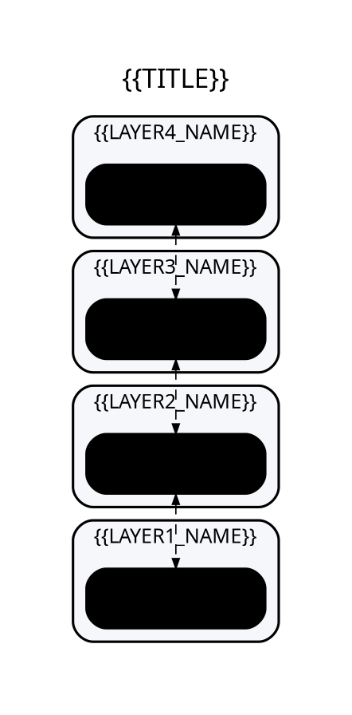
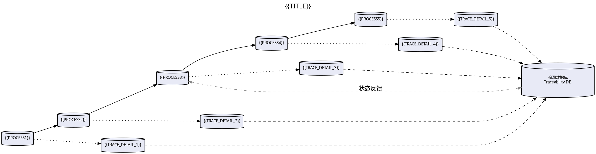
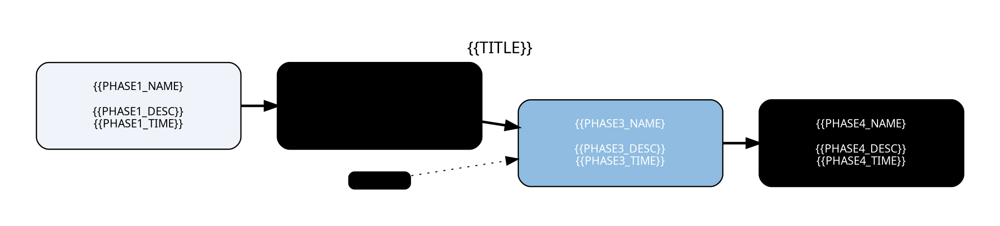
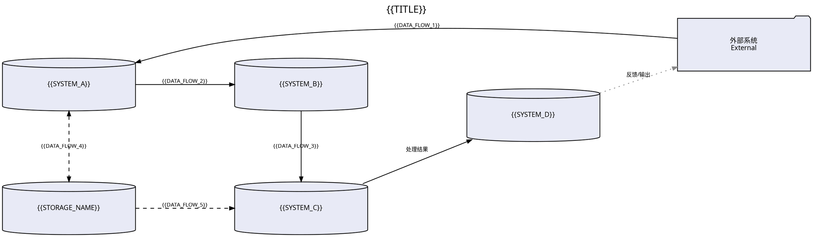

# DOT 图表模板库 (DOT Diagram Templates)

## 模板使用说明

每个模板使用 `{{PLACEHOLDER}}` 标记可替换参数。使用时按以下步骤操作：

1. 复制模板到新文件
2. 全局替换 `{{PLACEHOLDER}}` 为实际内容
3. 根据 [color-schemes.md](color-schemes.md) 选择合适的配色方案
4. 渲染：`dot -Tpng -Gdpi=300 template.dot -o output.png`

---

## 模板一：架构分层图 (Architecture Layered Diagram)

**适用场景：** 系统架构图、技术栈分层、网络协议栈



---

## 模板二：业务流程图 (Business Process Flow)

**适用场景：** 审批流程、业务操作步骤、判断分支流程

```dot
// ============================================================
// 模板：业务流程图（报价→合同→执行 通用流程）
// 说明：带判断节点的横向业务流
// 替换清单：
//   {{TITLE}}              — 图表标题
//   {{STEP1}} ~ {{STEP6}}  — 各步骤名称
//   {{DECISION}}           — 判断节点条件文字
//   {{YES_BRANCH}}         — 条件成立分支标签
//   {{NO_BRANCH}}          // 条件不成立分支标签
//   {{COLOR_PRIMARY}}      — 主色
//   {{COLOR_LIGHT}}        — 浅色
//   {{COLOR_BORDER}}       — 边框色
//   {{COLOR_FONT}}         — 字体色
// ============================================================

digraph ProcessFlow {
    rankdir=LR;
    nodesep=0.6;
    ranksep=1.0;
    
    graph [
        fontname="Microsoft YaHei",
        fontsize=16,
        label="{{TITLE}}",
        labelloc="t",
        bgcolor="white"
    ];
    
    // 普通步骤节点
    node [
        fontname="Microsoft YaHei",
        fontsize=11,
        shape=box,
        style="filled,rounded",
        fillcolor="{{COLOR_LIGHT}}",
        color="{{COLOR_BORDER}}",
        fontcolor="{{COLOR_FONT}}",
        penwidth=1.2,
        width=2.0,
        height=0.6
    ];
    edge [
        fontname="Microsoft YaHei",
        fontsize=9,
        color="{{COLOR_BORDER}}",
        penwidth=1.0
    ];
    
    // 流程步骤
    step1 [label="{{STEP1}}"];
    step2 [label="{{STEP2}}"];
    step3 [label="{{STEP3}}"];
    step4 [label="{{STEP4}}"];
    step5 [label="{{STEP5}}"];
    step6 [label="{{STEP6}}"];
    
    // 判断节点（菱形）
    decision [label="{{DECISION}}", shape=diamond, style=filled, fillcolor="#FFF8E1", color="{{COLOR_BORDER}}", fontcolor="{{COLOR_FONT}}"];
    
    // 起止标记
    start [label="开始", shape=ellipse, style=filled, fillcolor="{{COLOR_PRIMARY}}", fontcolor="white"];
    end [label="结束", shape=ellipse, style=filled, fillcolor="{{COLOR_PRIMARY}}", fontcolor="white"];
    
    // 主流程边
    start -> step1 -> step2 -> step3 -> decision;
    
    // 分支流程
    decision -> step4 [label="{{YES_BRANCH}}"];
    decision -> step5 [label="{{NO_BRANCH}}"];
    
    step4 -> step6 -> end;
    step5 -> end [style=dashed, color="#888888"];
}
```



---

## 模板三：工序追溯图 (Process Traceability)

**适用场景：** 制造工序追溯、质量追溯链、批次流转



---

## 模板四：技术演进路线图 (Technology Evolution Roadmap)

**适用场景：** 技术发展历程、产品迭代时间线、方案演进



---

## 模板五：数据流图 (Data Flow Diagram)

**适用场景：** 系统间数据流转、接口交互、微服务通信



---

## DOT 通用最佳实践

### 1. 方向控制 (`rankdir`)

| 值 | 含义 | 适用场景 |
|----|------|----------|
| `TB` | 从上到下 (Top→Bottom) | 分层架构、组织结构 |
| `LR` | 从左到右 (Left→Right) | 流程、时间线、数据流 |
| `BT` | 从下到上 | 反向追溯 |
| `RL` | 从右到左 | 阿拉伯语/希伯来语 |

### 2. 节点形状 (`shape`)

```dot
// 常用形状及其学术论文适用场景
node [shape=box]           // 矩形 — 通用节点
node [shape=box,style=rounded]  // 圆角矩形 — 系统/模块（推荐）
node [shape=diamond]       // 菱形 — 判断/决策
node [shape=ellipse]       // 椭圆 — 起点/终点
node [shape=cylinder]      // 圆柱 — 数据库/存储
node [shape=component]     // 组件 — 追溯/扫码节点
node [shape=folder]        // 文件夹 — 外部系统/文件
node [shape=plaintext]     // 纯文本 — 标签/注释
node [shape=record]        // 记录 — 复杂表格结构
```

### 3. 边样式 (`edge`)

```dot
edge [style=solid]         // 实线 — 主流程
edge [style=dashed]        // 虚线 — 辅助关系/异步
edge [style=dotted]        // 点线 — 弱关联/可选
edge [style=bold]          // 粗线 — 关键路径
edge [dir=both]            // 双箭头 — 双向数据流
edge [dir=none]            // 无箭头 — 关联关系
edge [arrowhead=none]      // 无箭头头 — 纯连接线
edge [arrowhead=normal]    // 标准箭头
edge [arrowhead=open]      // 空心箭头（UML 风格）
```

### 4. 子图分组 (`subgraph cluster`)

```dot
// cluster 前缀使子图显示为带边框的组
subgraph cluster_name {
    label="分组名称";
    style=filled;          // 填充背景
    color="#CCCCCC";       // 边框颜色
    fillcolor="#F5F5F5";   // 背景色
}
```

### 5. 同层对齐 (`rank=same`)

```dot
// 强制某些节点在同一水平/垂直位置
{ rank=same; node_a; node_b; node_c; }
```

### 6. 间距控制

```dot
graph [nodesep=0.5   // 同级节点水平间距
       ranksep=0.8]  // 不同层垂直间距
```

### 7. 高 DPI 渲染命令

```bash
# 300 DPI PNG（论文推荐）
dot -Tpng -Gdpi=300 input.dot -o output.png

# 固定尺寸 + 300 DPI
dot -Tpng -Gdpi=300 -Gsize=5.5,4\! input.dot -o output.png

# SVG 输出（矢量，推荐用于 LaTeX）
dot -Tsvg input.dot -o output.svg
```
